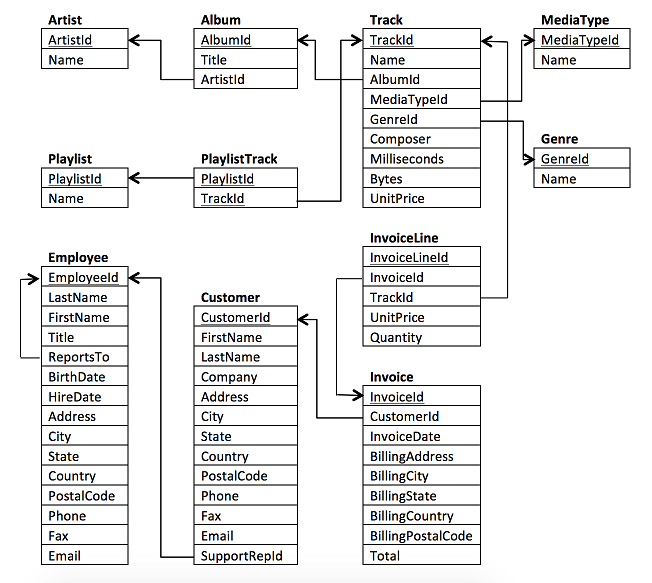

# DataScienceUdacity2: SQL

## Esquema do banco


### Quais países possuem mais faturas?

Use a tabela Invoice (Fatura) para determinar quais países possuem mais faturas. Forneça as tabelas de BillingCountry (país de cobrança) e Invoices (faturas) ordenadas pelo número de faturas para cada país.    
O país com mais faturas deve aparecer primeiro.   

```sql
SELECT BillingCountry, COUNT (InvoiceId)
FROM Invoice
GROUP BY BillingCountry
ORDER BY COUNT (InvoiceId) DES
```

Resposta: 

```text
USA;91
Canadá;56
...
```

### Qual cidade tem os melhores clientes?

Gostaríamos de lançar um festival de música promocional na cidade que nos gerou mais dinheiro. Escreva uma consulta que retorna a cidade que possui a maior soma dos totais de fatura. Retorne tanto o nome da cidade quanto a soma de todos os totais de fatura.

```sql
SELECT BillingCity, SUM (Total)
FROM Invoice
GROUP BY BillingCity
ORDER BY SUM (Total) DESC
```
Resposta: 

```text
A cidade com mais dólares em fatura foi Prague (Praga) com uma quantia de 90.24.
```

### Quem é o melhor cliente?

O cliente que gastou mais dinheiro será declarado o melhor cliente. Crie uma consulta que retorna a pessoa que mais gastou dinheiro. Eu encontrei essa informação ao linkar três tabelas: Invoice (fatura), InvoiceLine (linha de faturamento), e Customer (cliente). Você provavelmente consegue achar a solução com menos tabelas!

```sql
SELECT i.CustomerId, c.FirstName, c.LastName, SUM (i.Total)
FROM Invoice as i
JOIN Customer as c on i.CustomerId = c.CustomerId
GROUP BY i.CustomerId
ORDER BY SUM (i.Total) DESC
```
Resposta:
```text
O cliente que mais gastou de acordo com as faturas foi o Cliente 6 com 49.62 em compras.
```

### Pergunta 1

Use sua consulta para retornar o e-mail, nome, sobrenome e gênero de todos os ouvintes de Rock. Retorne sua lista ordenada alfabeticamente por endereço de e-mail, começando por A. Você consegue encontrar um jeito de lidar com e-mails duplicados para que ninguém receba vários e-mails?
Eu escolhi linkar as informações das tabelas Customer (cliente), Invoice (fatura), InvoiceLine (linha de faturamento), Track (música) e Genre (gênero), mas você pode encontrar outra forma de obter a informação.

```sql
SELECT c.Email, c.FirstName, c.LastName, g.Name
FROM Customer as c
JOIN Invoice as i on c.CustomerId = c.CustomerId
JOIN InvoiceLine as il on i.InvoiceId = il.InvoiceId
JOIN Track as t on il.TrackId = t.TrackId
JOIN Genre as g on t.GenreId = g.GenreId
GROUP BY c.Email
ORDER BY c.FirstName
```

Resposta: 

```text
aaronmitchell@yahoo.ca;Aaron;Mitchell;Rock
alero@uol.com.br;Alexandre;Rocha;Rock
astrid.gruber@apple.at;Astrid;Gruber;Rock
...
```

### Quem está escrevendo as músicas de rock?

Agora que sabemos que nossos clientes amam rock, podemos decidir quais músicos convidar para tocar no show.
Vamos convidar os artistas que mais escreveram as músicas de rock em nosso banco de dados. Escreva uma consulta que retorna o nome do Artist (artista) e a contagem total de músicas das dez melhores bandas de rock.
Você precisará usar as tabelas Genre (gênero), Track (música) , Album (álbum), and Artist (artista).

```sql
SELECT a.ArtistId,a.Name, COUNT (t.TrackId) as Soma
FROM Artist as a
JOIN Album as al on a.ArtistId = al.ArtistId
JOIN Track as t on al.AlbumId = t.AlbumId
JOIN Genre as g on t.GenreId = g.GenreId
WHERE g.Name = 'Rock'
GROUP BY a.Name
ORDER BY Soma DESC
```

```text
22;Led Zeppelin;114
150;U2;112
58;Deep Purple;92
90;Iron Maiden;81
118;Pearl Jam;54
152;Van Halen;52
...
```

### Pergunta 3

Primeiro, descubra qual artista ganhou mais de acordo com InvoiceLines (linhas de faturamento).
Agora encontre qual cliente gastou mais com o artista que você encontrou acima.
Para essa consulta, você precisará usar as tabelas Invoice (fatura), InvoiceLine (linha de faturamento), Track (música), Customer (cliente), Album (álbum) e Artist (artista).
Observe que essa consulta é complicada porque a quantia Total gasta na tabela Invoice (fatura) pode não ser em um só produto, então você precisa usar a tabela InvoiceLine (linha de faturamento) para descobrir quanto de cada produto foi comprado e, então, multiplicar isso pelo preço de cada artista.

```sql
SELECT a.Name, sum(il.UnitPrice * Quantity) as AmountSpend
FROM Artist as a
JOIN Album as al ON al.ArtistId = a.ArtistId
JOIN Track as t ON t.AlbumId = al.AlbumId
JOIN InvoiceLine as il ON il.TrackId = t.TrackId
JOIN Invoice as i ON i.InvoiceId = il.InvoiceId
JOIN Customer as c ON i.CustomerId = c.CustomerId
GROUP BY a.Name
ORDER BY AmountSpend DESC
```
Resposta:
```text
Iron Maiden;138.6
U2;105.93
Metallica;90.0899999999999
Led Zeppelin;86.1299999999999
Lost;81.59
The Office;49.75
...
```

```sql
SELECT a.Name, sum(il.UnitPrice * Quantity) as AmountSpend, c.CustomerId, c.FirstName, c.LastName
FROM Artist as a
JOIN Album as al ON al.ArtistId = a.ArtistId
JOIN Track as t ON t.AlbumId = al.AlbumId
JOIN InvoiceLine as il ON il.TrackId = t.TrackId
JOIN Invoice as i ON i.InvoiceId = il.InvoiceId
JOIN Customer as c ON i.CustomerId = c.CustomerId
WHERE a.Name = 'Iron Maiden'
GROUP BY c.CustomerId
ORDER BY AmountSpend DESC
```
Resposta:
```text
Iron Maiden;17.82;55;Mark;Taylor
Iron Maiden;15.84;35;Madalena;Sampaio
Iron Maiden;13.86;16;Frank;Harris
Iron Maiden;13.86;36;Hannah;Schneider
Iron Maiden;8.91;5;František;Wichterlová
Iron Maiden;8.91;27;Patrick;Gray
...
```


### SQL Avançado: Pergunta 1
Queremos descobrir o gênero musical mais popular em cada país. Determinamos o gênero mais popular como o gênero com o maior número de compras. Escreva uma consulta que retorna cada país juntamente a seu gênero mais vendido. Para países onde o número máximo de compras é compartilhado retorne todos os gêneros.
Para essa consulta você precisará usar as tabelas Invoice (fatura), InvoiceLine (linha de faturamento), Track (música), Customer (cliente) e Genre (gênero).

```sql
SELECT qur2.Purchases, qur3.Country, qur3.Name, qur3.GenreID
FROM
	(SELECT MAX(qur1.Quantity) Purchases, Country, Name, GenreID
	FROM 
		(SELECT SUM(il.Quantity) Quantity, c.Country Country, g.Name Name, g.GenreID GenreID
		FROM InvoiceLine il
		LEFT JOIN Invoice i ON i.Invoiceid = il.Invoiceid
		LEFT JOIN Customer c ON c.Customerid = i.Customerid
		LEFT JOIN Track t ON t.Trackid = il.Trackid
		LEFT JOIN Genre g ON g.Genreid = t.Genreid
		GROUP BY c.Country, g.Name, g.Genreid) qur1
	GROUP BY Country) qur2
LEFT JOIN (
	SELECT SUM(il.Quantity) Quantity, c.Country Country, g.Name Name, g.GenreID GenreID
	FROM InvoiceLine il 
	LEFT JOIN Invoice i ON i.invoiceid = il.invoiceid
	LEFT JOIN Customer c ON c.Customerid = i.Customerid
	LEFT JOIN Track t ON t.Trackid = il.Trackid
	LEFT JOIN Genre g ON g.Genreid = t.Genreid
	GROUP BY c.Country, g.Name, g.Genreid) qur3	
```
Resposta:
```text
9	Argentina	Alternative & Punk	4
9	Argentina	Rock	1
22	Australia	Rock	1
15	Austria	Rock	1
21	Belgium	Rock	1
81	Brazil	Rock	1
107	Canada	Rock	1
...
```
### SQL Avançado: Pergunta 2
Retorne todos os nomes de músicas que possuem um comprimento de canção maior que o comprimento médio de canção. Embora você possa fazer isso com duas consultas. Imagine que você queira que sua consulta atualize com base em onde os dados são colocados no banco de dados. Portanto, você não quer fazer um hard code da média na sua consulta. Você só precisa da tabela Track(música) para completar essa consulta.
Retorne o Name (nome) e os Milliseconds (milissegundos) para cada música. Ordene pelo comprimento da canção com as músicas mais longas sendo listadas primeiro.

```sql
SELECT Name, Milliseconds FROM Track
WHERE Milliseconds >= (SELECT AVG(Milliseconds) from Track)
ORDER BY Milliseconds DESC
```

```text
Occupation / Precipice	5286953
Through a Looking Glass	5088838
Greetings from Earth, Pt. 1	2960293
The Man With Nine Lives	2956998
Battlestar Galactica, Pt. 2	2956081
Battlestar Galactica, Pt. 1	2952702
Murder On the Rising Star	2935894
Battlestar Galactica, Pt. 3	2927802
Take the Celestra	2927677
Fire In Space	2926593
...
```

### SQL Avançado: Pergunta 3
Escreva uma consulta que determina qual cliente gastou mais em músicas por país. Escreva uma consulta que retorna o país junto ao principal cliente e quanto ele gastou. Para países que compartilham a quantia total gasta, forneça todos os clientes que gastaram essa quantia.
Você só precisará usar as tabelas Customer (cliente) e Invoice (fatura).
Verifique sua solução

